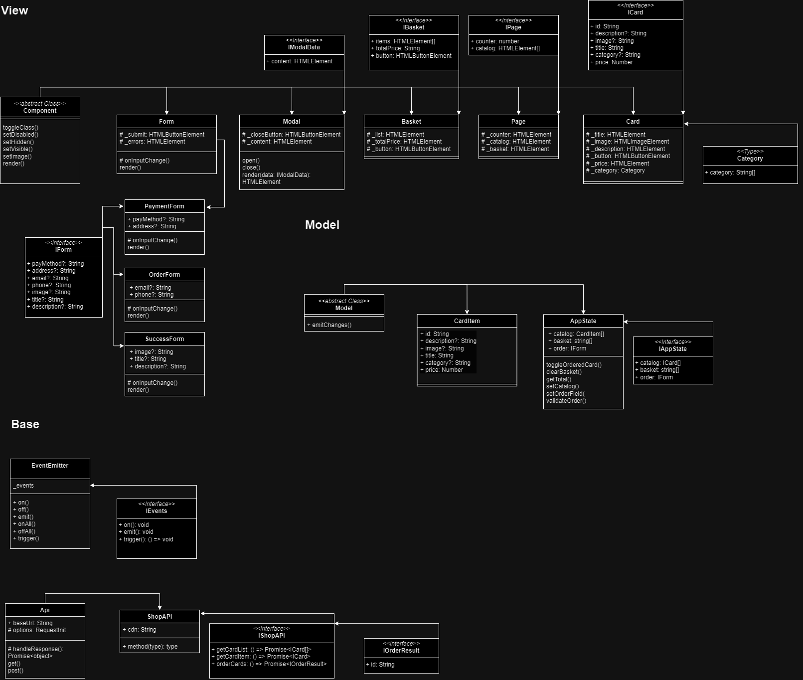

# Проектная работа "Веб-ларек"

Реализация интернет-магазина с товарами для веб-разработчиков — Web-ларёк. В нём можно посмотреть каталог товаров, добавить товары в корзину и сделать заказ.

Стек: HTML, SCSS, TS, Webpack

Структура проекта:

- src/ — исходные файлы проекта
- src/components/ — папка с JS компонентами
- src/components/base/ — папка с базовым кодом

Важные файлы:

- src/pages/index.html — HTML-файл главной страницы
- src/types/index.ts — файл с типами
- src/index.ts — точка входа приложения
- src/styles/styles.scss — корневой файл стилей
- src/utils/constants.ts — файл с константами
- src/utils/utils.ts — файл с утилитами

## Установка и запуск

Для установки и запуска проекта необходимо выполнить команды

```
npm install
npm run start
```

или

```
yarn
yarn start
```

## Сборка

```
npm run build
```

или

```
yarn build
```

## UML-диаграмма классов и интерфейсов



## Описание данных

### Класс EventEmitter

Класс EventEmitter обеспечивает работу событий в приложении. Он предоставляет возможность установки и снятия слушателей событий, а также вызова слушателей при возникновении события.

### Компоненты и их функции

В архитектуре проекта выделяются следующие компоненты:

#### Form

Отображает форму для ввода данных.
Функции: render(), onInputChange().
Взаимодействует с компонентом Button.

#### Modal

Отображает модальное окно.
Функции: open(), close(), render(data: IModalData).
Взаимодействует с компонентами, переданными через данные (например, содержимым модального окна).

#### Basket

Отображает содержимое корзины.
Функции: отображение элементов корзины, расчет общей стоимости.
Взаимодействует с компонентами-элементами корзины и кнопкой.

#### Page

Отображает страницу приложения.
Функции: управление каталогом, отображение счетчика, отображение корзины.
Взаимодействует с компонентами каталога, корзины и счетчика.

#### Card

Отображает карточку товара.
Функции: отображение информации о товаре.
Взаимодействует с данными карточки товара.

#### API

Обеспечивает взаимодействие с сервером.
Функции: отправка GET и POST запросов, обработка ответов.
Взаимодействует с сервером для получения и отправки данных.

### Взаимодействие компонентов

Компоненты формы (Form, PaymentForm, OrderForm, SuccessForm) взаимодействуют с кнопкой для отправки формы (компонент Button).
Модальное окно (Modal) взаимодействует с другими компонентами, переданными через данные (например, содержимым модального окна).
Компоненты страницы (Page) взаимодействуют с каталогом товаров, корзиной и счетчиком.
Компонент корзины (Basket) взаимодействует с элементами корзины и кнопкой.
Компонент карточки товара (Card) взаимодействует с данными карточки товара.

### Используемые данные

Для хранения данных используются следующие типы данных или интерфейсы:

ICard: описывает структуру карточки товара.
IForm: описывает структуру формы с вводом данных.
IModalData: описывает данные модального окна.
IOrderResult: описывает результат заказа.
IEvents: интерфейс для работы с событиями.
IShopAPI: интерфейс для работы с API магазина.
IAppState: интерфейс для хранения состояния приложения.

### Реализация процессов в приложении

Процессы в приложении реализуются через взаимодействие компонентов и использование событий. Например, при отправке формы происходит взаимодействие формы с кнопкой, которое инициирует отправку данных на сервер через API. Взаимодействие между компонентами происходит с использованием событий, что позволяет организовать отслеживание и обработку различных событий в приложении.

---

## Подробное описание классов и их функций

#### abstract Class Component

Этот абстрактный класс предоставляет базовые функции для работы с компонентами пользовательского интерфейса.

toggleClass(): Метод для переключения класса компонента.
setDisabled(): Метод для установки состояния "отключено" компонента.
setHidden(): Метод для скрытия компонента.
setVisible(): Метод для отображения компонента.
setImage(): Метод для установки изображения компонента.
render(): Метод для отрисовки компонента.

Классы расширяющие Component:

#### Class Form

Этот класс представляет форму и наследует базовый класс Component. Он содержит свои собственные атрибуты и методы.
\_submit: HTMLButtonElement - Кнопка отправки формы.
\_errors: HTMLElement - Элемент для отображения ошибок формы.
onInputChange(): Метод для обработки изменения ввода.
render(): Метод для отрисовки формы.

#### Class PaymentForm

Этот класс представляет форму оплаты и расширяет класс Form. Он добавляет свои собственные атрибуты.
payMethod?: String: Способ оплаты.
address?: String: Адрес.

#### Class OrderForm

Этот класс представляет форму заказа и также расширяет класс Form. Он добавляет свои собственные атрибуты.
email?: String: Электронная почта.
phone?: String: Номер телефона.

#### Class SuccessForm

Этот класс представляет форму успешного завершения и также расширяет класс Form. Он добавляет свои собственные атрибуты.
image?: String: Изображение.
title?: String: Заголовок.
description?: String: Описание.

#### abstract Class Model

Этот абстрактный класс предоставляет базовые функции для моделей данных.
emitChanges(): Метод для генерации событий об изменениях.

Классы расширяющие Model:

#### Class CardItem

Этот класс представляет элемент карточки и расширяет класс Model. Он содержит атрибуты, описывающие информацию о карточке.
id: String: Идентификатор карточки.
description?: String: Описание карточки.
image?: String: Изображение карточки.
title: String: Заголовок карточки.
category?: String: Категория карточки.
price: Number: Цена карточки.

#### Class AppState

Этот класс представляет состояние приложения и также расширяет класс Model. Он содержит атрибуты, хранящие информацию о каталоге товаров, корзине и заказе.
catalog: CardItem[]: Каталог товаров.
basket: string[]: Корзина.
order: IForm: Заказ.

### Описание интерфейсов

#### Interface IForm

Интерфейс, описывающий структуру формы.
payMethod?: String: Способ оплаты.
address?: String: Адрес.
email?: String: Электронная почта.
phone?: String: Номер телефона.
image?: String: Изображение.
title?: String: Заголовок.
description?: String: Описание.

#### Interface IModalData

Интерфейс, описывающий данные модального окна.
content: HTMLElement: Содержимое модального окна.

#### Interface IBasket

Интерфейс, описывающий структуру корзины.
items: HTMLElement[]: Элементы корзины.
totalPrice: String: Общая стоимость.
button: HTMLButtonElement: Кнопка корзины.

#### Interface IPage

Интерфейс, описывающий структуру страницы.
counter: number: Счётчик.
catalog: HTMLElement[]: Элементы каталога.

#### Interface ICard

Интерфейс, описывающий структуру карточки.
id: String: Идентификатор карточки.
description?: String: Описание карточки.
image?: String: Изображение карточки.
title: String: Заголовок карточки.
category?: String: Категория карточки.
price: Number: Цена карточки.

#### Type Category

Тип данных, описывающий категории.

### Базовые классы

#### Class EventEmitter

Базовый класс, предоставляющий функциональность для работы с событиями.
\_events: Хранит события и их обработчики.
on(): Метод для подписки на событие.
off(): Метод для отписки от события.
emit(): Метод для генерации события.
onAll(): Метод для подписки на все события.
offAll(): Метод для отписки от всех событий.
trigger(): Метод для выполнения события.

#### Class Api

Класс для работы с API.
baseUrl: String: Базовый URL.
options: RequestInit: Опции запроса.
handleResponse(): Метод для обработки ответа.
get(): Метод для выполнения GET-запроса.
post(): Метод для выполнения POST-запроса.

#### Class ShopAPI

Класс для работы с API магазина, расширяющий базовый класс Api.
cdn: String: URL для CDN.

### Интерфейсы

#### Interface IEvents

Интерфейс для работы с событиями.
on(): void: Метод для подписки на событие.
emit(): void: Метод для генерации события.
trigger(): () => void: Метод для выполнения события.

#### Interface IShopAPI

Интерфейс для работы с API магазина.
getCardList: () => Promise<ICard[]>: Метод для получения списка карточек.
getCardItem: () => Promise<ICard>: Метод для получения карточки.
orderCards: () => Promise<IOrderResult>: Метод для заказа карточек.

#### Interface IOrderResult

Интерфейс для хранения результата заказа.
id: String: Идентификатор заказа.
